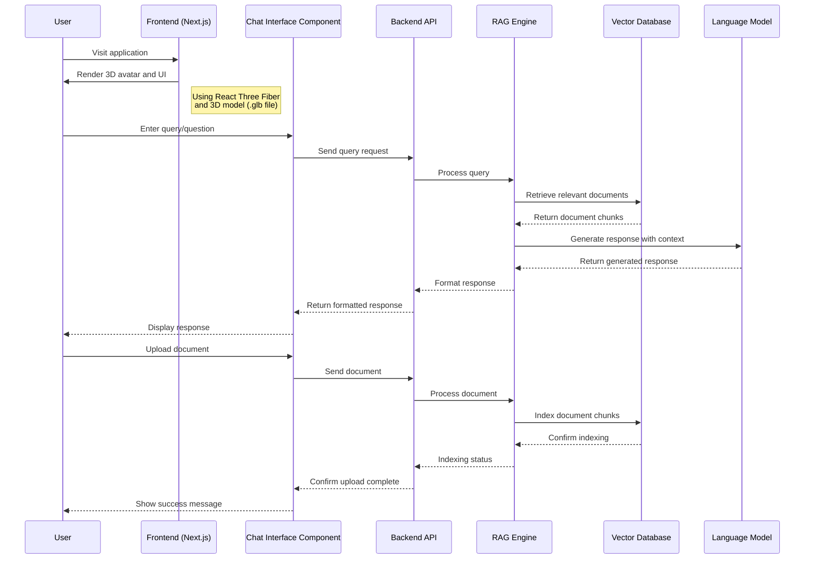

# RAG Virtual Agent v2 - Frontend

## Project Overview

This is the frontend component of a RAG (Retrieval-Augmented Generation) Virtual Agent application. The project is built using Next.js and React, with a focus on creating an interactive 3D virtual agent experience. The application leverages modern web technologies to provide a responsive and engaging user interface.
The frontend includes:

- 3D model rendering capabilities using Three.js and React Three Fiber
- UI components built with shadcn/ui and Radix UI primitives
- TypeScript for type safety and better developer experience
- Tailwind CSS for styling with a custom configuration

## Tech Stack

### Core Technologies

- Next.js : v15.3.2 - React framework with server-side rendering capabilities
- React : v19.0.0 - JavaScript library for building user interfaces
- TypeScript : v5.x - Typed JavaScript for better developer experience

### 3D Rendering

- Three.js : v0.176.0 - JavaScript 3D library
- @react-three/fiber : v9.1.2 - React renderer for Three.js
- @react-three/drei : v10.0.7 - Useful helpers for React Three Fiber

### UI Components

- shadcn/ui : v0.0.4 - Component library built on Radix UI
- Radix UI : Various components including:
  - react-avatar: v1.1.9
  - react-label: v2.1.6
  - react-slot: v1.2.2
  - react-tabs: v1.1.11
- Lucide React : v0.510.0 - Icon library

### Styling

- Tailwind CSS : v4.x - Utility-first CSS framework
- class-variance-authority : v0.7.1 - For creating variant components
- clsx : v2.1.1 - Utility for constructing className strings
- tailwind-merge : v3.3.0 - Merge Tailwind CSS classes without conflicts
- tw-animate-css : v1.2.9 - Animation utilities for Tailwind

### Development Tools

- ESLint : v9.x - JavaScript linter
- Turbopack : Used in development mode for faster builds

## Getting Started

### Prerequisites

- Node.js (compatible with Next.js 15.3.2)
- npm or yarn

### Installation

    # clone repo this repo to your machine first
    git clone https://github.com/MartinZakhaev/rag_prototype_v2_fe.git

    # Navigate to the frontend directory
    cd rag_prototype_v2_fe

    # Install dependencies (this project utilize npm package manager)
    npm install

### Development

    # Run the development server with Turbopack
    npm run dev

## Project Structure

- /app : Next.js app directory containing pages and layouts
- /components : Reusable UI components
- /lib : Utility functions and shared code
- /public : Static assets including 3D models
- /types : TypeScript type definitions

## UML diagrams

